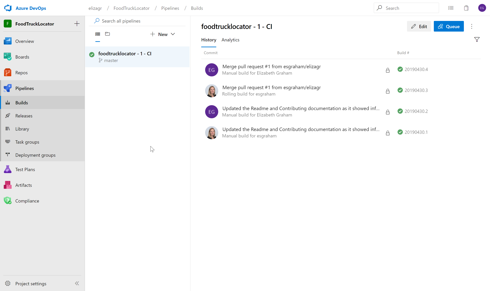

# Food Truck Locator #

This project uses an excel file from San Francisco's Data Source to fetch all food truck locations around the city.  The project uses Azure Maps to plot trucks on a map and determines the distance to the truck from the center of the city.

The finished product can be found here:  <https://foodtrucklocator.azurewebsites.net>

## Architecture ##

The project is a web application that connects to Azure Maps to render a map display with a search box.  The web application uses Azure Maps SDK to make calls to the service.  The application has been deployed to an Azure Web App and uses Azure DevOps for continuous deployment.

## Code ##

The code is based off the sample Store Locator code provided by the Azure Maps product team.  The code is written in Nodejs and the web application code can be found under the FoodTruckLocator folder.

Webpack was used to bundle the code into a single directory for deployment.  The Dotenv component was installed and can be used with webpack to create and store environment variables using an .env file.  Currently the Azure Maps authentication key is stored in the file with a variable of AzureMapsKey.  Webpack also allows us to test the code as it runs witin an Azure Web App.

### Running Locally ###

To run the code on a local machine the following should be taken after cloning the project:

1. Create an Azure Map object in Azure and copy the Authentication Key.
2. Create an .env file and add AzureMapsKey=<Authentication Key from step 1>
3. In the terminal window move to the FoodTruckLocator folder.
4. Run npm install
5. Run npx webpack -- config webpack.config.js
6. To start the website run: npm run start

## Testing ##

Mocha was used for creating and running unit test.  The unit test files can be found under the Test/Data folder.  Do to the time limit, only one unit test was created to test the parsing of the excel file.

## Deployment ##

The project uses git as its source control with two branches.  The master branch contains the code that is deployed to Azure.  The elizagr branch is the development branch for myself.  Additional branches can be added as more developers work on the project.  Each branch uses the developers alias or username.  A pull request must be done to add code to the master branch.

The project does not allow rebasing.  The reason is that Azure Maps is in preview and as coding occurs, issues may arise that we want to capture in the history but do not want to add to the production code.  

Once the master branch is updated, Azure DevOps has a pipeline that was built for continous deployment to the Azure Web App.

## Next Steps ##

At this time there are few items that did not get completed due to time constraints:

1. The search is working, but searches the entire country.
2. The images and icons still use the Coffee images. Need to update to trucks.
3. Prettier was installed and configured to help format the javascript, but not used.  Need to go back and format the code.
4. Create an ARM template for deployment using Zip file.

## Related Sample Projects ##

* [Azure Maps Tutorial Samples](https://github.com/Azure-Samples/azure-maps-samples/tree/master/src)

## Additional Resources ##

* [Azure Maps (main site)](https://azure.com/maps)
* [Azure Maps Documentation](https://docs.microsoft.com/azure/azure-maps/index)
* [Azure Maps Blog](https://azure.microsoft.com/blog/topics/azure-maps/)
* [MSDN Forums](https://social.msdn.microsoft.com/Forums/en-US/home?forum=azurelbs)
* [StackOverflow [azure-maps]](https://stackoverflow.com/questions/tagged/azure-maps)
* [Azure Maps feedback](https://feedback.azure.com/forums/909172-azure-maps)

## License ##

MIT
 
See [License](LICENSE.md) for full license text.
